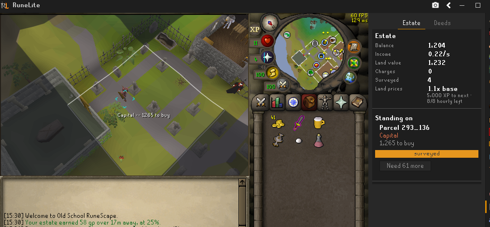
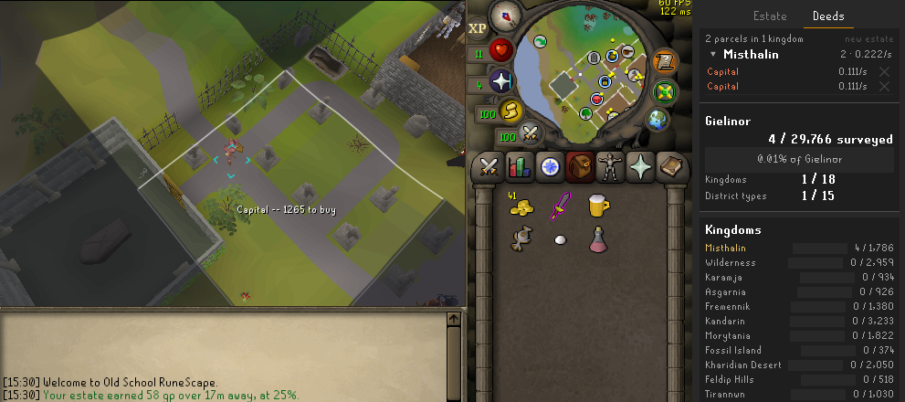
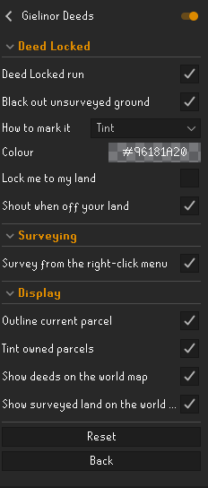

# Gielinor Deeds

Own the ground you stand on.

A single-player land game played over the real Old School RuneScape map.
Gielinor is divided into **115,200 parcels** of 8x8 tiles, **29,766** of which
can be owned. Every one was classified from the game's own cache -- the Varrock
square is Capital, the fields round Lumbridge are Farmland, scorched ground is
Wasteland -- and priced accordingly.

**Nothing leaves your PC.** No account, no server, no network traffic of any
kind. Your estate is saved in RuneLite's own settings on your computer.

---

## Deed Locked

The challenge run. Off by default; turn it on and it begins wherever you are
standing.

You are given **that one deed** and **three survey charges**. Everything else is
dark. A charge reveals a neighbouring deed and its price. Buying one is what
lets you survey past it, so the map opens outward from your estate a deed at a
time.

Two things drive it, and neither advances alone:

* **Survey charges** come from XP and from levelling up, and nothing else.
* **Money** comes from rent on the land you already own.

Nothing blocks movement. The veil hides ground and the menu filter can refuse
clicks if you ask it to, but you can always walk out. The run is on your honour.

## Ordinary play

With Deed Locked off the whole map is visible, you survey wherever you stand,
and survey range upgrades become worth buying. Land is bought for its own sake.

---

## Surveying

A survey takes five seconds and costs one charge. Right-click the ground and
pick **Survey deed**, or use the button in the side panel for the deed under
your feet. It is never the left-click action, so a stray click cannot spend a
charge.

Charges come from playing. XP pays at a rate scaled to the level of the skill
that earned it, capped at 8 an hour so efficient training cannot outpace
ordinary play. Levelling up pays on top of that cap.

## Rent

Land pays rent every second. Time logged out pays a quarter of the normal rate,
capped at 8 hours, and you are told what you earned when you return.

Prices climb as your estate grows, so there is always something to save for.

## The sidebar

**Estate** is what you are doing right now: balance, income, charges, and the
deed under your feet with the button to survey or buy it.

**Deeds** is the map. Your holdings are grouped by kingdom and collapsed, so a
large estate is a handful of rows rather than hundreds. Below that, the Deed Log
tracks how much of each of the 18 kingdoms and 15 district types you have seen,
and which of the 66 landmarks you have found.

## Settings

---

## Licence

BSD 2-Clause. See `LICENSE`.
